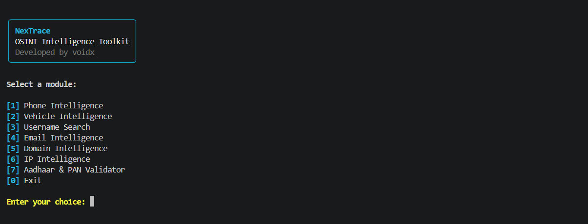

<div align="center">

# 🔎 NexTrace

### OSINT Intelligence Toolkit

**A modular Python CLI for public-source intelligence, metadata analysis, and offline validation.**

Developed by **voidx**

</div>

---

## 🖥️ Preview

<div align="center">



</div>

---

## 🧠 About NexTrace

**NexTrace** is a modular Python-based OSINT toolkit designed to bring multiple public-source intelligence and validation utilities into one clean command-line interface.

The project focuses on useful intelligence signals while maintaining clear privacy and responsible-use boundaries.

It was built as a cybersecurity learning project with an emphasis on understanding how public metadata, DNS infrastructure, numbering systems, registration formats, and other OSINT signals can be analyzed using Python.

---

## ⚡ Modules

| # | Module | Capabilities |
|---|---|---|
| `01` | 📱 **Phone Intelligence** | Number validation, formatting, region, carrier, type and timezone metadata |
| `02` | 🚗 **Vehicle Intelligence** | Indian registration parsing, State/UT detection and verified RTO mappings where available |
| `03` | 👤 **Username Search** | Public username discovery across supported platforms |
| `04` | 📧 **Email Intelligence** | Syntax validation, DNS/MX analysis and mail-provider indicators |
| `05` | 🌐 **Domain Intelligence** | DNS, MX, TXT, SPF, DMARC and infrastructure analysis |
| `06` | 🛰️ **IP Intelligence** | IPv4/IPv6 classification and public reverse-DNS analysis |
| `07` | 🪪 **Aadhaar & PAN Validator** | Offline structural and checksum/format validation |

---

## 📱 Phone Intelligence

Analyzes public phone-numbering metadata using international numbering-plan information.

### Capabilities

- Input normalization
- Phone-number validation
- E.164 formatting
- International formatting
- National formatting
- RFC3966 formatting
- Country calling code detection
- ISO region detection
- Number type detection
- Carrier metadata
- Timezone metadata
- Numbering-plan analysis

> **Note:** Carrier information can represent the originally assigned network and may become outdated after number portability. Region and timezone metadata do not represent a person's current or live location.

---

## 🚗 Vehicle Intelligence

Analyzes the structure of Indian vehicle registration numbers.

### Capabilities

- Registration normalization
- State / UT detection
- RTO code extraction
- Registration series extraction
- Registration-number parsing
- Verified registering-authority lookup where available

The current verified RTO dataset is intentionally limited and can be expanded using reliable public transport-authority sources.

> **Privacy:** NexTrace does not retrieve vehicle-owner names, private addresses, contact information, or live vehicle locations.

---

## 👤 Username Search

Checks supported public platforms for profiles matching a username.

### Currently Supported

- GitHub
- GitLab
- Reddit
- Pinterest

NexTrace classifies responses as:

```text
Found
Not Found
Uncertain
Error
```

`Uncertain` is intentionally used when a platform returns an ambiguous response rather than forcing a potentially incorrect result.

> **Important:** Finding the same username on multiple websites does not prove that those accounts belong to the same person.

---

## 📧 Email Intelligence

Analyzes an email address and the publicly visible infrastructure of its domain.

### Capabilities

- Email syntax validation
- Email normalization
- Local-part extraction
- Domain extraction
- DNS resolution
- MX record discovery
- Mail-receiving infrastructure signal
- Mail-provider estimation
- Domain IPv4 / IPv6 discovery
- Disposable-domain heuristic

> A correctly formatted email address or configured mail server does **not** prove that a specific mailbox exists, is active, or belongs to a particular person.

NexTrace does not perform mailbox login attempts or authentication bypasses.

---

## 🌐 Domain Intelligence

Analyzes publicly available DNS and mail-security configuration.

### DNS Intelligence

- A records
- AAAA records
- NS records
- CNAME records
- MX records
- TXT records

### Mail Security

- SPF detection
- SPF policy display
- DMARC detection
- DMARC policy display
- Mail-provider estimation

> DNS records describe infrastructure. They do not prove private ownership or identify a specific individual.

---

## 🛰️ IP Intelligence

Analyzes IPv4 and IPv6 addresses using local classification and standard public reverse-DNS resolution.

### Capabilities

- IPv4 validation
- IPv6 validation
- Address normalization
- Public/global detection
- Private-range detection
- Loopback detection
- Link-local detection
- Multicast detection
- Reserved-range detection
- Reverse-DNS hostname lookup

> An IP address does not identify a specific person and should not be treated as an exact or live physical location.

---

## 🪪 Aadhaar & PAN Validator

Provides privacy-conscious **offline validation**.

### Aadhaar Validator

- Input normalization
- 12-digit structure validation
- Structural checks
- Verhoeff checksum validation
- Masked terminal output

### PAN Validator

- Input normalization
- PAN pattern validation
- Masked terminal output

> Passing validation only means that the supplied value matches the checks performed by NexTrace. It does not confirm official issuance, active status, ownership, or identity.

No private identity database is queried.

---

## 🛠️ Tech Stack

| Technology | Purpose |
|---|---|
| **Python** | Core application |
| **Rich** | CLI interface and formatted reports |
| **phonenumbers** | Phone-numbering metadata |
| **Requests** | Public HTTP requests |
| **dnspython** | DNS infrastructure analysis |
| **ipaddress** | IP parsing and classification |
| **socket** | Reverse-DNS resolution |

---

## 📁 Project Structure

```text
NexTrace/
│
├── assets/
│   └── nextrace-menu.png
│
├── nextrace/
│   ├── __init__.py
│   ├── cli.py
│   ├── phone.py
│   ├── phone_utils.py
│   ├── vehicle.py
│   ├── rto_data.py
│   ├── username.py
│   ├── username_sites.py
│   ├── email_intel.py
│   ├── domain_intel.py
│   ├── ip_intel.py
│   └── identity_validator.py
│
├── .gitignore
├── LICENSE
├── README.md
└── requirements.txt
```

---

## ⚙️ Installation

### 1. Clone NexTrace

```bash
git clone https://github.com/rahularyann1/NexTrace.git
cd NexTrace
```

### 2. Create a virtual environment

```bash
python -m venv .venv
```

### 3. Activate it

#### Windows PowerShell

```powershell
.\.venv\Scripts\Activate.ps1
```

If PowerShell blocks script execution for the current terminal session:

```powershell
Set-ExecutionPolicy -Scope Process -ExecutionPolicy Bypass
.\.venv\Scripts\Activate.ps1
```

#### Linux / macOS

```bash
source .venv/bin/activate
```

### 4. Install dependencies

```bash
pip install -r requirements.txt
```

---

## 🚀 Running NexTrace

From the project root:

```bash
python -m nextrace.cli
```

You should see:

```text
NexTrace
OSINT Intelligence Toolkit
Developed by voidx

Select a module:

[1] Phone Intelligence
[2] Vehicle Intelligence
[3] Username Search
[4] Email Intelligence
[5] Domain Intelligence
[6] IP Intelligence
[7] Aadhaar & PAN Validator
[0] Exit
```

---

## 📊 Understanding Results

NexTrace treats OSINT results as **intelligence signals rather than identity proof**.

Public information can be:

- Outdated
- Incomplete
- Ambiguous
- Incorrect
- Blocked by anti-automation systems
- Changed after NexTrace performs a lookup

Always verify important findings through multiple legitimate sources.

---

## 🛡️ Responsible Use

NexTrace is designed for:

- Cybersecurity education
- OSINT learning
- Defensive research
- Public metadata analysis
- Authorized investigations
- Personal lab environments

NexTrace is **not designed to provide authorization** for accessing private systems or information.

The toolkit does not intentionally provide:

- Private SIM/KYC subscriber records
- Private Aadhaar identity records
- Private PAN/taxpayer records
- Private vehicle-owner records
- Password or authentication bypass
- Inbox access
- Credential testing
- Live person/device tracking
- Interception of private communications

Use NexTrace only where you have the legal right and appropriate authorization to do so.

---

## ⚠️ Accuracy & Limitations

Different modules have different limitations:

**Phone Intelligence**  
Carrier and region metadata may be stale or affected by number portability.

**Vehicle Intelligence**  
RTO mappings identify registration authorities, not current vehicle locations. The verified mapping dataset is currently limited.

**Username Search**  
Automated requests can be blocked or handled differently by individual platforms.

**Email Intelligence**  
Mail infrastructure does not confirm whether a specific mailbox exists.

**Domain Intelligence**  
DNS records can change at any time.

**IP Intelligence**  
Reverse-DNS records may be unavailable or outdated.

**Identity Validator**  
Structural validation does not establish official issuance or ownership.

---

## 🗺️ Roadmap

- [ ] Expanded verified RTO mappings
- [ ] Additional public username platforms
- [ ] RDAP-based domain intelligence
- [ ] ASN and network-owner metadata
- [ ] Structured report export
- [ ] Batch analysis workflows
- [ ] Automated testing
- [ ] Improved confidence scoring
- [ ] Better error handling and diagnostics

---

## 🆘 KuchuPuchu, It's Not Working?

KuchuPuchu, error aa gaya? 😭

Before reporting an issue, check that:

1. Python is installed.
2. The virtual environment is activated.
3. Dependencies are installed with `pip install -r requirements.txt`.
4. NexTrace is being run from the project root.

Still stuck?

**KuchuPuchu, samajh nahi aaya? Message kar do. We'll figure it out. 🫡**

Bug reports, suggestions, and contributions are welcome.

---

## 👨‍💻 Author

### voidx

Built while learning **Cybersecurity, OSINT, Python, and Digital Investigation.**

Still learning.  
Still building.  
Still breaking things occasionally. 😭

---

## 📜 License

NexTrace is released under the **MIT License**.

See the `LICENSE` file for details.

---

## ⚖️ Disclaimer

NexTrace is provided for educational, defensive-security, research, and authorized OSINT purposes.

Users are responsible for ensuring their use of the toolkit complies with applicable laws, platform policies, and authorization requirements.

The project does not provide authorization to access systems, accounts, networks, or private information.

---

<div align="center">

**NexTrace • Developed by voidx**

*Stay curious. Investigate responsibly.*

</div>